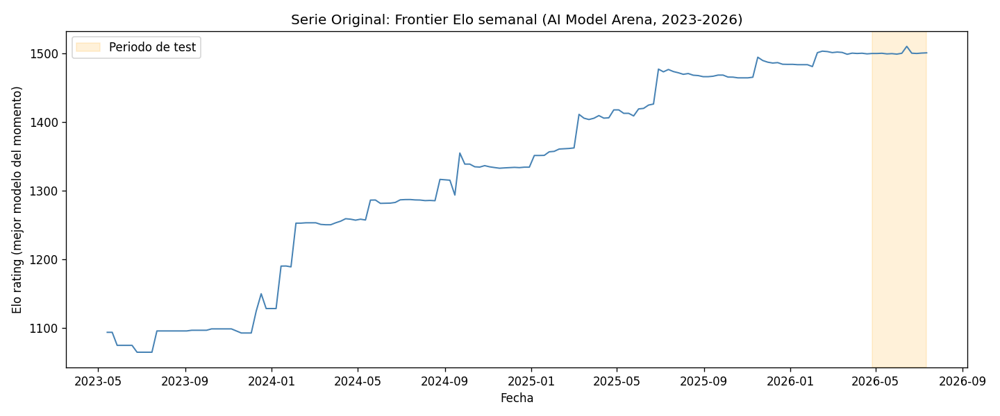
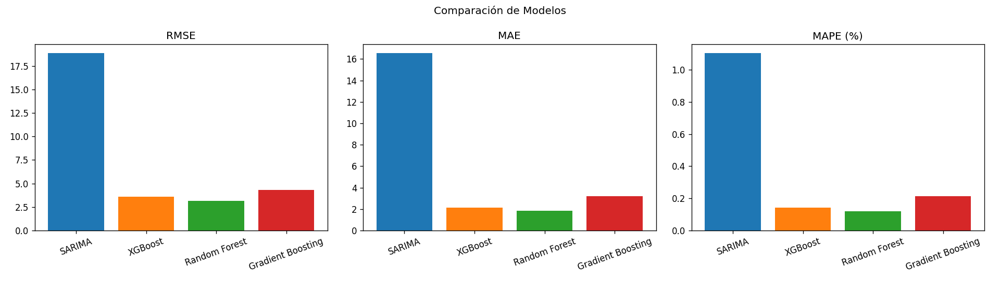
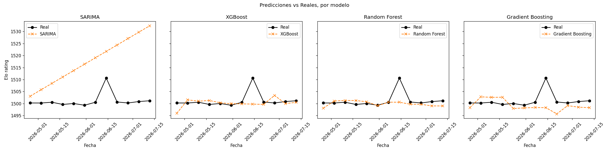

<div align="center">

# Forecasting de la "Frontier Elo" en AI Model Arena

### Prediciendo la evolucion del techo de capacidad de la IA (2023-2026)


Proyecto Final - Series Temporales
Maestria en Inteligencia Artificial, FIUNA

</div>

---

> **Resumen** Se construyo una serie temporal real (el rating Elo maximo
> semanal entre 461 modelos de lenguaje, 2023-2026) a partir de un dataset con
> fechas irregulares, y se compararon 4 modelos de forecasting: **SARIMA**
> (estadistico) contra **Random Forest, XGBoost y Gradient Boosting** (machine
> learning). Random Forest gano con amplio margen (RMSE 3.16 vs. 18.86 de SARIMA),
> y se identifico con precision la causa raiz: el termino de tendencia constante de
> SARIMA no logra adaptarse a una desaceleracion reciente que los modelos de ML si
> detectan.

## Indice

1. [Descripcion del problema](#1-descripcion-del-problema)
2. [Dataset utilizado](#2-dataset-utilizado)
3. [Metodologia aplicada](#3-metodologia-aplicada)
4. [Modelos implementados](#4-modelos-implementados)
5. [Resultados y metricas](#5-resultados-y-metricas)
6. [Visualizaciones](#6-visualizaciones)
7. [Conclusiones](#7-conclusiones)

---

## 1. Descripcion del problema

Desde mayo de 2023, la comunidad de IA rastrea el desempeño relativo de los modelos de
lenguaje (LLMs) mediante un sistema de ranking tipo Elo, alimentado por comparaciones
directas entre modelos ("arena" de votacion humana). En cada fecha de publicacion del
leaderboard existe un modelo con el rating mas alto: ese valor, al que llamamos
**"Frontier Elo"**, representa la frontera de capacidad de la IA en ese momento.

El objetivo de este proyecto es **predecir la evolucion futura del Frontier Elo**, es
decir, estimar que tan rapido seguira subiendo el techo de capacidad de los modelos de
IA en las proximas semanas, usando tecnicas clasicas de forecasting de series
temporales.

Este problema es relevante porque el ritmo de mejora de la IA no es perfectamente
lineal: hay saltos (cuando sale un nuevo modelo lider) y mesetas (cuando ningun modelo
nuevo logra superar al lider anterior). Modelar esta dinamica ayuda a entender si el
progreso se esta acelerando, desacelerando, o estabilizando.

<div align="center">

</div>

---

## 2. Dataset utilizado

| | |
|---|---|
| **Fuente** | `ai_model_arena_rankings_csv.csv` (Kaggle - leaderboard publico de arena de LLMs) |
| **Filas originales** | 97,377 registros |
| **Modelos distintos** | 461 |
| **Fechas de publicacion** | 247 (2023-05-08 a 2026-07-10) |
| **Subsets/arenas** | `text`, `text_style_control`, `vision`, `webdev`, `search` |
| **Variable objetivo** | `elo_max` = rating maximo por fecha (subset `text`) |
| **Observaciones tras regularizar** | 166 semanales (>> 100 requeridas) |

**Justificacion de la eleccion.** Se descarto seguir un unico modelo individual
porque muchos quedan discontinuados a mitad de la serie (generando huecos); el
maximo por fecha da una serie continua y con significado claro (frontera de
capacidad), cumpliendo ampliamente el minimo de 100 observaciones temporales
exigido por la consigna.

**Preprocesamiento de frecuencia.** Las publicaciones del leaderboard no ocurren a
intervalos regulares (a veces cada semana, a veces cada 3-4 semanas), y casi nunca
caen exactamente en domingo. Se re-muestreo la serie a **frecuencia semanal fija**
con `resample('W').last()` seguido de *forward-fill*, para las semanas sin una
nueva publicacion (el lider no cambia hasta que aparece uno mejor). Esto dejo
**166 observaciones semanales** regulares, aptas para modelos como SARIMA.

---

## 3. Metodologia aplicada

1. **EDA**: exploracion de la estructura del dataset, fechas, modelos y subsets
   (`01_preprocesamiento.ipynb`).
2. **Construccion de la serie objetivo**: agregacion por maximo (`groupby` + `max`)
   sobre el subset `text`.
3. **Regularizacion temporal**: `resample('W').last()` + `ffill()` para pasar de
   fechas irregulares a una serie semanal continua (ver nota tecnica en la seccion 2).
4. **Analisis de estacionariedad**: test de Dickey-Fuller aumentado (ADF) y
   descomposicion estacional (tendencia / estacionalidad / residuo).
5. **Feature engineering** (para los modelos de ML): lags (1, 2, 4, 8, 12 semanas),
   medias y desvios moviles calculados estrictamente sobre valores pasados
   (`shift(1)` antes de `rolling`), features ciclicas de calendario (seno/coseno de
   la semana del ano) e indice de tendencia temporal.
6. **Split train/test**: se respeto estrictamente el orden temporal, reservando las
   ultimas 12 semanas como conjunto de test (142 semanas de train, 0 fechas en comun
   entre ambos conjuntos, verificado programaticamente).
7. **Modelado**: un modelo estadistico (SARIMA) y tres modelos de machine learning
   (XGBoost, Random Forest, Gradient Boosting), ver seccion 4.
8. **Evaluacion**: calculo de metricas de error y analisis de residuales
   (`03_evaluacion.ipynb`).

---

## 4. Modelos implementados

### SARIMA (categoria: Estadistico)

Orden seleccionado automaticamente via `pmdarima.auto_arima` (busqueda stepwise por
AIC) sobre la serie de entrenamiento. El modelo elegido fue `ARIMA(0,1,1)` con
termino de deriva (drift) constante e igual a **2.66 puntos Elo por semana**; no se
selecciono ningun componente estacional (el buscador stepwise no encontro
estacionalidad util con periodo 52, algo esperable con menos de 3 ciclos completos
en el historial disponible).

### XGBoost, Random Forest y Gradient Boosting (categoria: Machine Learning)

Tres modelos de ensamble de arboles (`XGBRegressor`, `RandomForestRegressor`,
`GradientBoostingRegressor`) entrenados sobre las mismas features de
lags/rolling/calendario, lo que permite una comparacion justa entre algoritmos.
Como cada modelo predice un paso a la vez, el pronostico a 12 semanas se genero de
forma recursiva: en cada paso se recalculan los lags usando las predicciones de los
pasos anteriores.

**4 modelos de 2 categorias distintas** (estadistico vs. machine learning), superando
el minimo de 2 modelos exigido por la consigna.

---

## 5. Resultados y metricas

| Modelo | RMSE | MAE | MAPE (%) |
|---|---|---|---|
| **Random Forest** | **3.16** | **1.82** | **0.121** |
| XGBoost | 3.62 | 2.24 | 0.149 |
| Gradient Boosting | 4.34 | 3.22 | 0.214 |
| SARIMA | 18.86 | 16.56 | 1.103 |

Los tres modelos de Machine Learning superaron ampliamente a SARIMA en todas las
metricas de error, con **Random Forest a la cabeza** (RMSE de 3.16 frente a 18.86 de
SARIMA, casi 6 veces menor).

<div align="center">

</div>

### Por que SARIMA se desempeno tan mal

El termino de drift de SARIMA (+2.66 puntos/semana) fue estimado sobre las 154
semanas completas de entrenamiento, un promedio dominado por el crecimiento rapido
de 2023-2024 (cuando la serie subio de 1094 a ~1500). Sin embargo, en las ultimas
15-20 semanas antes del corte de test la frontera ya se habia estancado: el
crecimiento promedio real de las ultimas 20 semanas de train fue de apenas +0.70 por
semana, y las ultimas 15 semanas oscilaron practicamente planas entre 1481 y 1503.

Un `ARIMA(0,1,1)` con drift constante no puede distinguir entre "tendencia de largo
plazo" y "lo que esta pasando ahora mismo": aplica el promedio historico completo
hacia adelante sin importar que el comportamiento reciente ya muestre otra cosa, y
por eso extrapola una subida continua que en los hechos no ocurrio. Los modelos de
ML, al depender de lags cortos (1 a 12 semanas), si detectan ese estancamiento
reciente y ajustan su prediccion en consecuencia.

---

## 6. Visualizaciones

<div align="center">

</div>

Todas las visualizaciones requeridas se generan en `results/`:

| Archivo | Contenido |
|---|---|
| `graficos_serie_original.png` | Serie temporal original completa, con el tramo de test resaltado |
| `graficos_pred_vs_real.png` | Predicciones vs. valores reales, un panel por modelo |
| `graficos_comparacion_modelos.png` | Comparacion de RMSE / MAE / MAPE entre modelos (grafico de barras) |
| `graficos_residuales.png` | Analisis de residuales (real menos predicho) por modelo |
| | Adicionales del preprocesamiento |

---

## 7. Conclusiones

- Se logro construir una serie temporal real y con significado (frontera de
  capacidad de IA) a partir de un dataset de rankings con fechas irregulares,
  documentando y corrigiendo un error de resampling (`asfreq` vs.
  `resample().last()`) detectado durante la validacion del pipeline.
- Los tres modelos de Machine Learning (Random Forest, XGBoost, Gradient Boosting)
  superaron ampliamente a SARIMA en todas las metricas de error para el horizonte
  de test evaluado. **Random Forest tuvo el mejor desempeno general.**
- La causa raiz del bajo desempeno de SARIMA quedo identificada con precision: su
  termino de drift constante refleja el crecimiento historico completo y no logra
  adaptarse a la desaceleracion que ya era visible en las semanas previas al corte
  de test. Los modelos de ML, al usar lags cortos, capturan mejor ese estancamiento
  reciente.
- **Limitaciones**: horizonte de test relativamente corto (12 semanas); el drift
  constante de SARIMA es una eleccion de modelo limitada frente a alternativas con
  tendencia amortiguada.
- **Trabajo futuro**: evaluar con validacion cruzada temporal (rolling origin) en
  lugar de un unico corte train/test; probar un SARIMA con tendencia amortiguada o
  reestimada sobre una ventana movil mas corta; incorporar modelos de deep learning
  (LSTM, N-BEATS) capaces de capturar mejor los saltos discretos; añadir como
  feature exogena la cantidad de modelos nuevos lanzados por semana.

---

## Estructura del repositorio

```
TP_FINAL/
├── data/
│   ├── datos.csv                 # Dataset original
│   ├── serie_semanal.csv         # Serie objetivo regularizada
│   └── features_semanal.csv      # Features para los modelos de ML
├── notebooks/
│   ├── 01_preprocesamiento.ipynb
│   ├── 02_modelos.ipynb
│   └── 03_evaluacion.ipynb
├── results/
│   ├── metricas.csv
│   ├── predicciones.csv
│   └── graficos_*.png
├── presentacion.pptx
├── README.md
└── requirements.txt
```

## Como reproducir

```bash
pip install -r requirements.txt
jupyter nbconvert --to notebook --execute --inplace notebooks/01_preprocesamiento.ipynb
jupyter nbconvert --to notebook --execute --inplace notebooks/02_modelos.ipynb
jupyter nbconvert --to notebook --execute --inplace notebooks/03_evaluacion.ipynb
```

---

<div align="center">

**Tatiana Caballero** - Maestria en Inteligencia Artificial, FIUNA

</div>